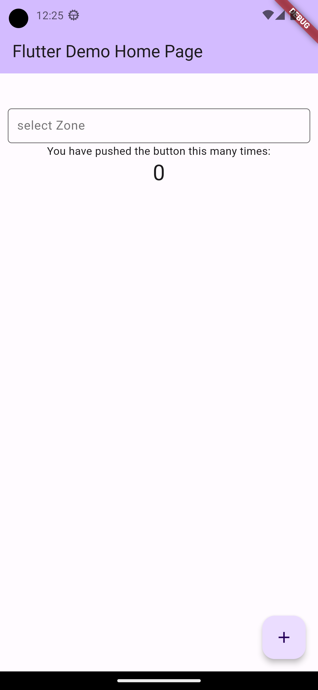

this package is use for make a search on data which is coming from API or anywhere  
 
 

 
 

you just have to make a modal json map 

make your modal from  
https://app.quicktype.io/

 
 

///function for refresh data in list/// 

void _runZone(String enteredKeyword) { 
List<dynamic> results = []; 
if (enteredKeyword.isEmpty) { 
results = zoneData; 
} else { 
results = zoneData 
.where((user) => user["name"]// """name""" write a name of your key to make filter 
.toLowerCase() 
.contains(enteredKeyword.toLowerCase())) 
.toList(); 
} 
setState(() { 
newZoneData = results; 
zoneListStatusMap = 
(newZoneData).map<Modal>((de) => Modal.fromMap(de)).toList();//uses modal to refresh data in suggestion list 
}); 
} 

